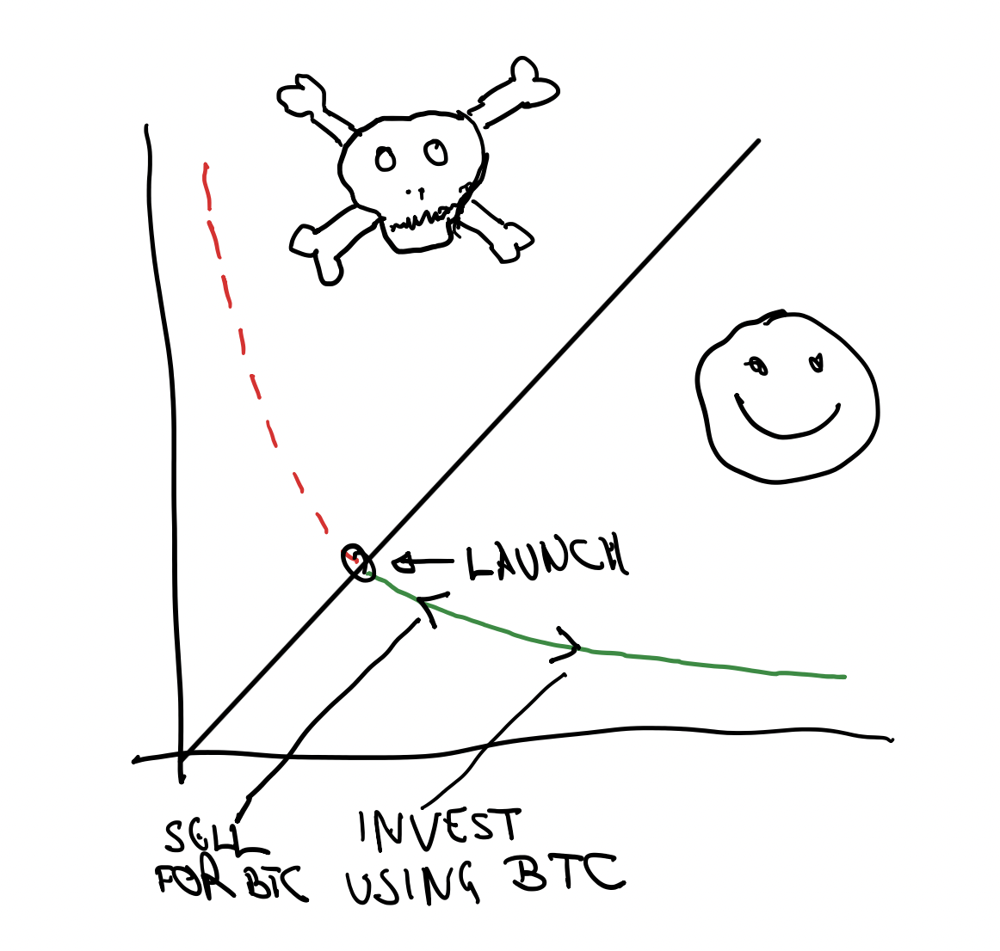

# bitvestor-launchpad
Bitvestment - Single Sided Liquidity Launchpad AMM for Token Investment using Bitcoin

See demo and video [here](./demo/README.md).

# Abstract

I created a specialized Automated Market Maker (AMM) to allow Launchpad style investment in Share Tokens using Bitcoin, by running on Bitcoin Layer 2 EVM blockchains. It achieves fairness to all investors by enforcing the creation of the Token, placement of all its liquidity in the AMM and making sure that there is no pre-existing token supply held by a malicious actor. In addition the initial liquidity is single-sided, avoiding the need to underwrite the initial supply with actual capital.

# Introduction

The primary reason the Bitcoin Layer 2 blockchains exist is to allow the Bitcoin holders to invest their capital. One of the most popular mechanisms for this is Tokenized Share investments. This is usually done by Launchpads in order to control the fairness of the investment process. Launchpads:

- Provide ways to invest in on-chain Tokens / Shares
- Enforce pre-determined rules
- Provide fairness and transparency
- Avoid rug-pulls
- Provide common pricing rules for all participants
- Investors can trade the Tokens back-and-forth, especially during the initial offering campaign and have confidence in the fairness of the process

But there are issues with the Launchpads. They:
- need initial liquidity provider
- use existing AMMs
- use concentrated liquidity AMMs to avoid underwriters (initial LP), but are restricted to potentially unsuitable AMM formula

# Solution

Bitvestment allows Token launchers to create a known fair and honest process, and give such trustless assurance to the investors:
- The Token is created by Bitvestment, preventing unfair pre-existing distributions.
- There is no need for Underwriters as all Token liquidity is one-sided, avoiding the need for initial capital and is deployed on the Bitvestment AMM.
- No rug pulls are possible as no one can own a stash of tokens acquired without payment.

# How it works

The contracts are written in Solidity and they create the Token, all it's supply and deploy it at the AMM as one-sided liquidity, as shown below:

There is simple no possibility to trade in the range to the left of the diagonal line, which represents the initial price.

# Benefits

The benefits of using Bitvestment are:
- No dishonest / hidden pre-sales are possible.
- No Underwriters' capital is needed.
- No rug-pulls are possible as no one can own unpaid Tokens.

# Economics

Bitvestment does not charge anything for launching Tokens. Only the AMM charges 0.1% in Bitcoin (native L2 token) for each purchase and sale transactions, which is distributed to the owner of Bitvestment as revenue. The Liquidity is not inflated, as that would create a stockpile of tokens that would be hard to manage, and it would be somewhat unfair to the participants.

# Implementation

The contracts are written in Solidity and deployed on the Bitcoin Layer 2 described [here](./demo/README.md).

The rudimentary front end written in React and using Ethers.js serves as a sample for the organizations launching their Investment Share Tokens to copy and provide a more presentable user interface and pleasant experience.